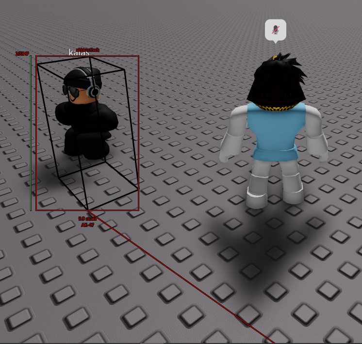

# 🏓 Base


Do not initialise this class. It is used in order to inherit some key functions in order to reduce boilerplate code.



If using as intended, make sure to clone the constructor and update method - then change accordingly.


## Showcase

<figure><figcaption>
Each ESP Object Class at once on a player
</figcaption></figure>
